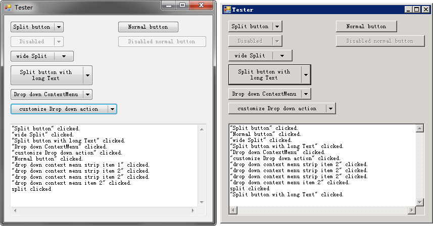

# Screenshots


# Introduction

`SplitButton` is normal button with a split area, which can drop down a menu or other behavior. I deliberately make it look like a standard control, so there are no many appearance members. It supports themed and classic style, tested on xp-win10.

There are some special members:
```c#
// split area width
int SplitWidth { get; set; }

// set a ContextMenuStrip as the drop down menu
ContextMenuStrip SplitDropDownMenuStrip { get; set; }

// set a ContextMenu as the drop down menu
ContextMenu SplitDropDownMenu { get; set; }

// customize split area click behavior
event EventHandler ClickSplit;
```

The precedence is `ClickSplit` > `SplitDropDownMenu` > `SplitDropDownMenuStrip`.

# Todo
- Allow set the direction of arrow
- Allow Image(include gif)
- Implement the `Flat` and `Popup` styles